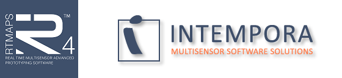

### How to use FindRTMaps.cmake :

Here is a simple example of use to create your RTMaps project with CMakeLists.txt :

```cmake
include(FindRTMaps.cmake)
add_library( my_module SHARED my_module.cpp my_module.h )
target_link_libraries(my_module rtmaps_pck)
configure_rtmaps(my_module)

```


### How to test example in vc10

To test the example launch build_x86_vc10.bat or enter these command lines : 
	
	> mkdir x86_vc10
	> cd x86_vc10
	> cmake -G"Visual Studio 10" ../src
	-- The C compiler identification is MSVC 16.0.40219.1
	-- The CXX compiler identification is MSVC 16.0.40219.1
	-- Check for working C compiler using: Visual Studio 10
	-- Check for working C compiler using: Visual Studio 10 -- works
	-- Detecting C compiler ABI info
	-- Detecting C compiler ABI info - done
	-- Check for working CXX compiler using: Visual Studio 10
	-- Check for working CXX compiler using: Visual Studio 10 -- works
	-- Detecting CXX compiler ABI info
	-- Detecting CXX compiler ABI info - done
	-- Found RTMaps in C:/Program Files (x86)/Intempora/RTMaps 4/include
	-- RTMAPS_INCLUDE = C:/Program Files (x86)/Intempora/RTMaps 4/include
	-- RTMAPS_LIBRARY = C:\Program Files (x86)\Intempora\RTMaps 4/lib/vc.net2010
	-- RTMaps was found here C:\Program Files (x86)\Intempora\RTMaps 4
	-- Configuring done
	-- Generating done
	-- Build files have been written to: A:/git/rtmaps_cmake/x86_vc10


### License MIT 

Copyright (c) 2014 Amaury BREHERET

Permission is hereby granted, free of charge, to any person obtaining a copy
of this software and associated documentation files (the "Software"), to deal
in the Software without restriction, including without limitation the rights
to use, copy, modify, merge, publish, distribute, sublicense, and/or sell
copies of the Software, and to permit persons to whom the Software is
furnished to do so, subject to the following conditions:

The above copyright notice and this permission notice shall be included in
all copies or substantial portions of the Software.

THE SOFTWARE IS PROVIDED "AS IS", WITHOUT WARRANTY OF ANY KIND, EXPRESS OR
IMPLIED, INCLUDING BUT NOT LIMITED TO THE WARRANTIES OF MERCHANTABILITY,
FITNESS FOR A PARTICULAR PURPOSE AND NONINFRINGEMENT. IN NO EVENT SHALL THE
AUTHORS OR COPYRIGHT HOLDERS BE LIABLE FOR ANY CLAIM, DAMAGES OR OTHER
LIABILITY, WHETHER IN AN ACTION OF CONTRACT, TORT OR OTHERWISE, ARISING FROM,
OUT OF OR IN CONNECTION WITH THE SOFTWARE OR THE USE OR OTHER DEALINGS IN
THE SOFTWARE.

